# Lab 01 Report - Introduction to Open Source Software

## Discord

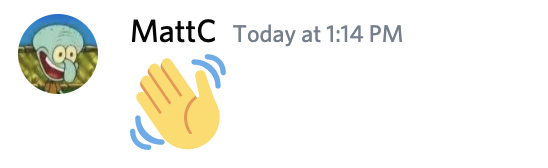

## Reading

Open Source Definition: I think part 9 of the definition is interesting.
I didn't know that open source licenses must not restrict what other software
is distributed with the licensed software. I can think of at least a couple
projects that consider themselves to be "open source" yet violate this
principle.

Smart Questions: I've encountered this quite a lot in the open source
community, both when answering questions related to my own projects and asking
questions about others. I always try to give thoughtful answers to people,
however it can be tedious to constantly answer the same kinds of questions.

How to Answer Questions in a Helpful Way: Always consider whether to add
the answer to a question to the documentation/FAQ. Ask what questions the user
has already tried to solve the problem, so you don't waste time suggesting
things that have already been tried.

## Free Culture

I'm surprised I've never heard of this case before, as it happened right at
RPI. Jesse obviously did nothing wrong. It seems like the RIAA just needed to
make an example out of someone to deter people from pirating their music. With
that said, there are many other people in the mix, like the people actually
pirating the music, that the RIAA had a stronger case against. It seems likely
that they went after Jesse because he was either the least likely to fight the
case, or because they didn't understand exactly what he had built and how it
worked. However, this does not excuse their actions. As absurd as it is, I
guess we should all consider how we could be liable for how others choose to
use the infrastructure we build. It's definitely something I will continue to
think about.

## Tree

Output of `man tree`:

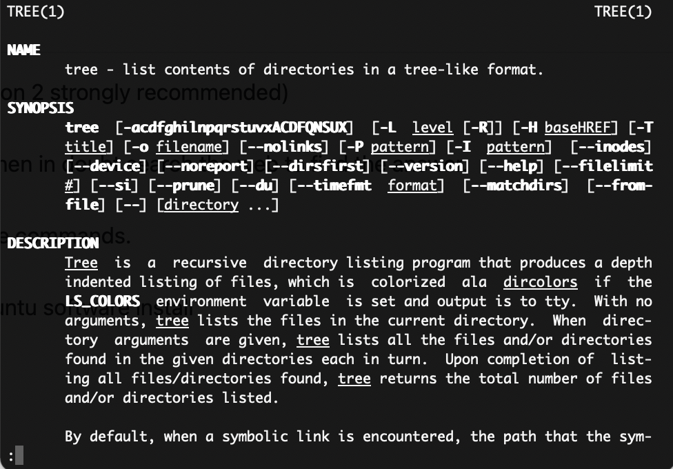

## Regex

Completed first 7 exercises:

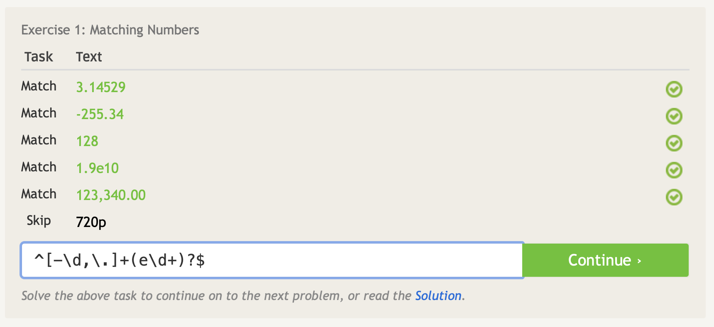

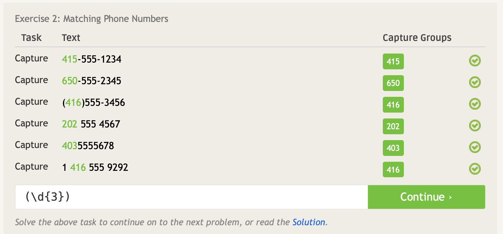

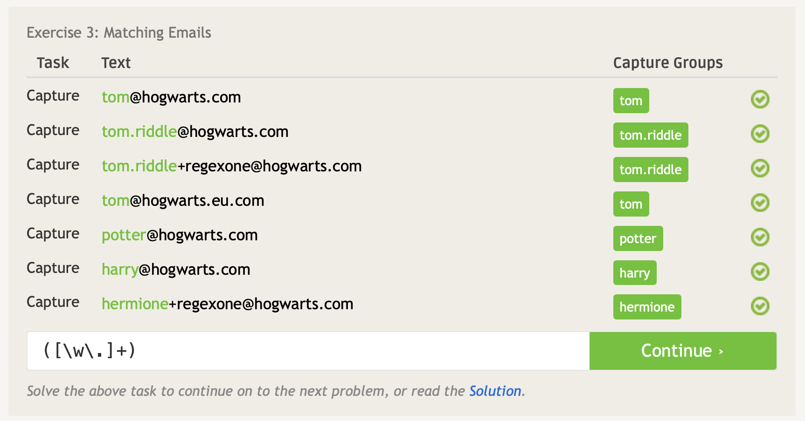

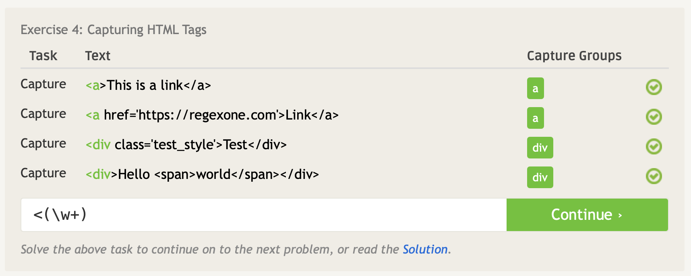

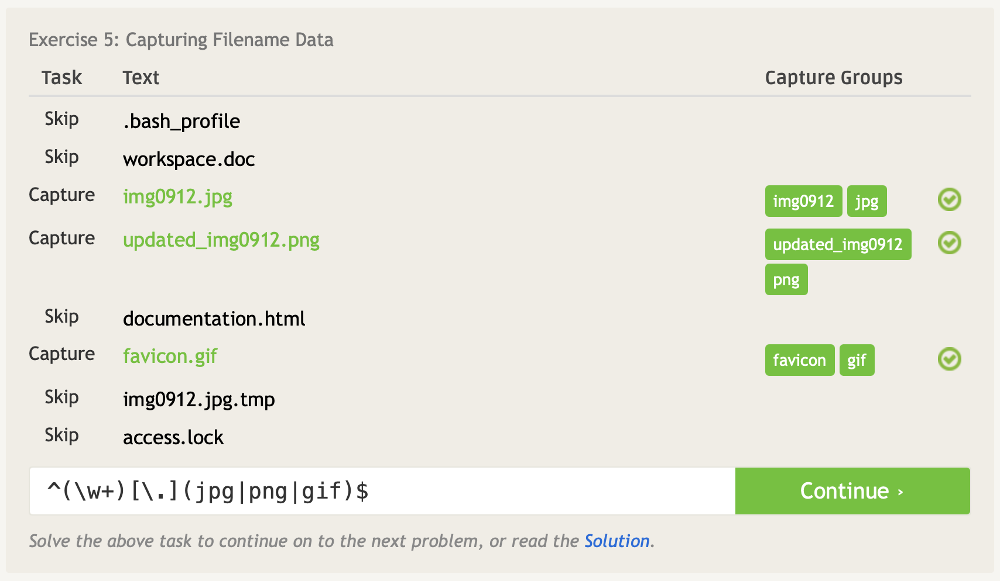

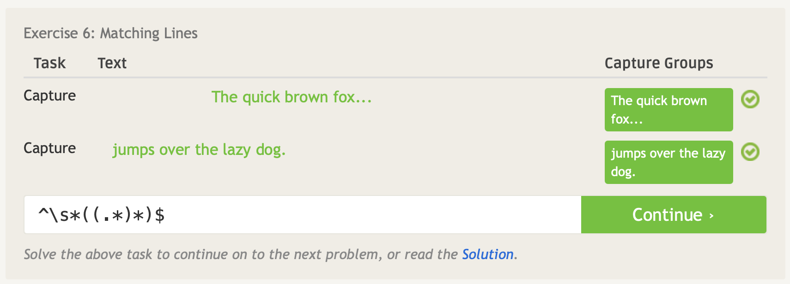

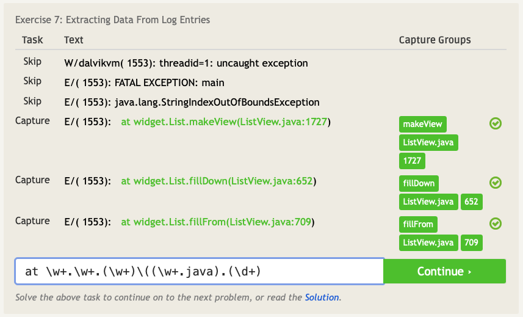

Completed first 4 beginner regex crosswords:

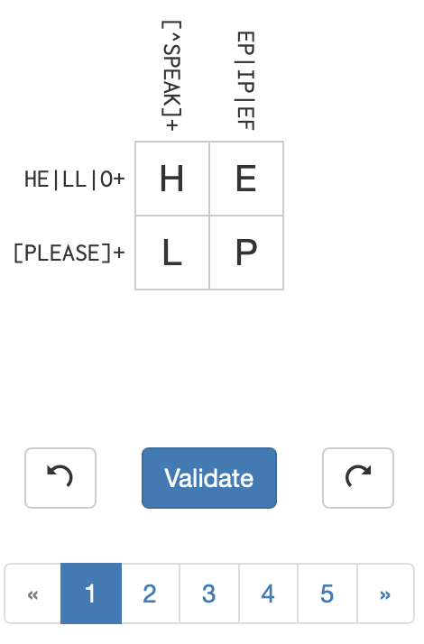

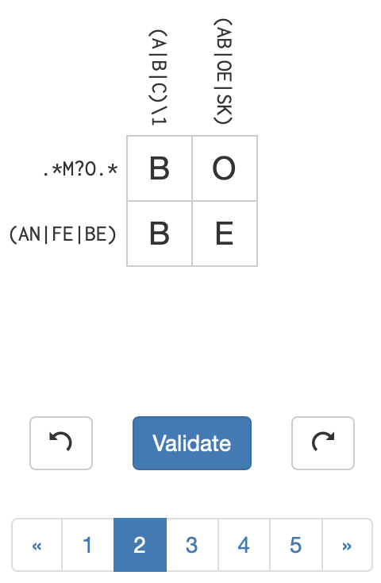

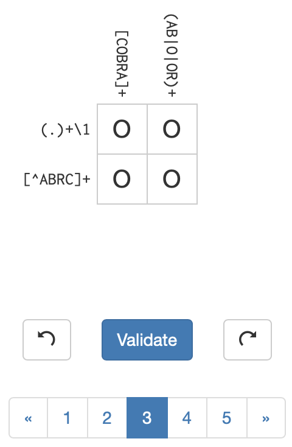

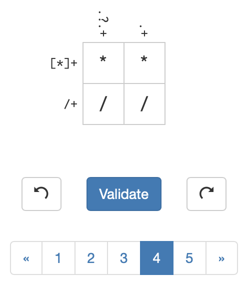

## Blockly

After a lot of experimenting, I was able to solve the maze with 4 blocks left:

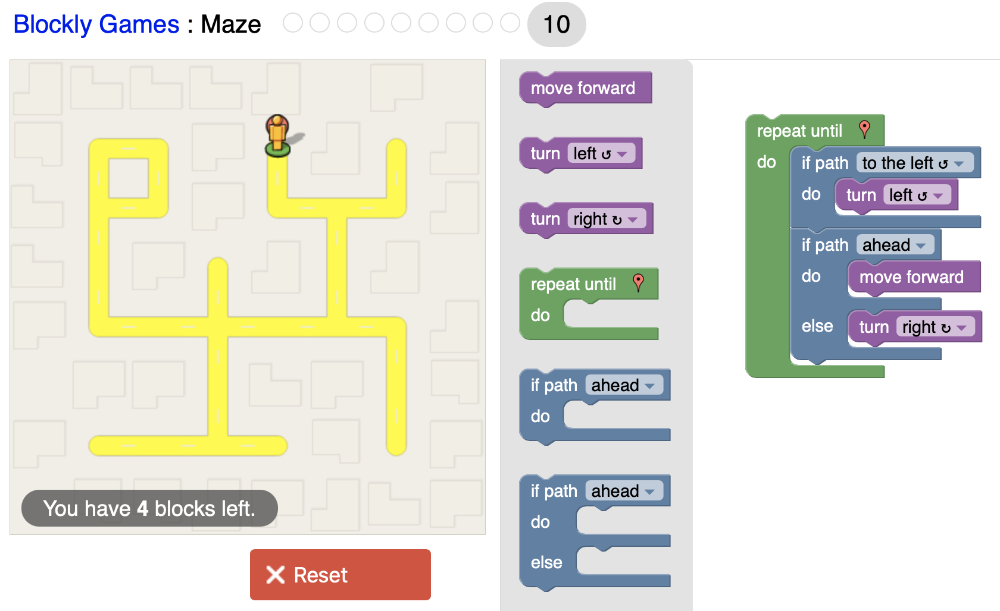

## Reflection

I'd like to evaluate [Electrum](https://github.com/spesmilo/electrum), an open
source Bitcoin wallet. Its focus is on being as lightweight and simplistic as
possible, letting the servers handle the complex parts of the Bitcoin system.
The project was started in 2011, and has been contributed to by a few hundred
developers since then. It is released under the MIT license. I find this to be
an interesting project because I use it as my personal Bitcoin wallet, and
because security and privacy are extremely important in it. I'm curious as to
what security measures are in place and how they are implemented.

