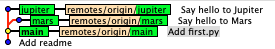
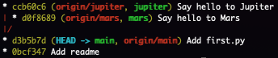
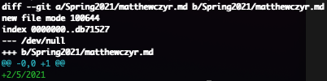

# Lab 02 Report

## Part 1

https://github.com/MattCzyr/lab2part1

`gitk --all` vs. `git log --graph --oneline --decorate --all`:

## Part 2

https://github.com/MattCzyr/Spoon-Knife

Completed first 4 levels of Learn Git Branching:

## Part 3

https://github.com/MattCzyr/PullReq

Output of `git diff HEAD~1`:

Output of `git tag -l`:

https://github.com/joshmalek/OSSProjectIdeas

