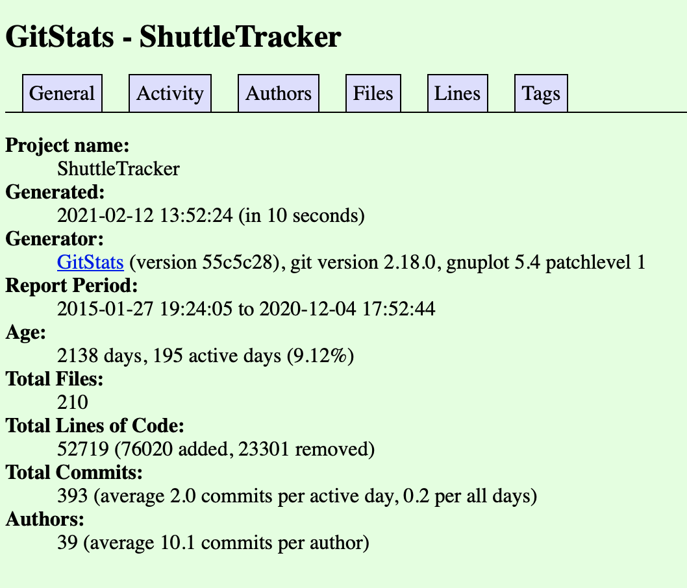

# Lab 03 Report

## Part 1: Documentation

Wiki: https://github.com/MattCzyr/CSCI-4470/wiki/Lab-3

LaTeX:

`$\sqrt{1 + 2 \sqrt{1 + 3 \sqrt{1 + 4 \sqrt{1 + \ldots}}}}$`


`$\sqrt{2}^{\sqrt{2}^{\sqrt{2}^{\sqrt{2}^{\ldots}}}}$`


```
$\begin{bmatrix}
1 & 1 & 1 & 1\\
-1 & 1 & -1 & 1\\
-1 & -1 & 1 & 1\\
1 & -1 & -1 & 1
\end{bmatrix}$
```


## Part 2: Community

Shuttle Tracker:
- Contributors: 33
- Lines of code: ~62,000
- [Initial commit](https://github.com/wtg/shuttletracker/commit/3453b12cb6d53080a0967644eddf44111fef0c54) on January 27, 2015 by gbprz
- [Latest commit](https://github.com/wtg/shuttletracker/commit/3e8b9af6a7d8b341b605f137cf2b4577edd6bed3) on December 4, 2020 by MattCzyr
- Branches: 55



The results of `gitstats` are a bit different than the stats from `git`, but
they're in the same ballpark. For example, 33 contributors vs. 39 contributors,
and ~62,000 lines of code vs. ~53,000 lines of code.

Screenshot of `gource`:


