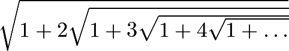
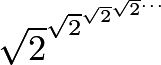
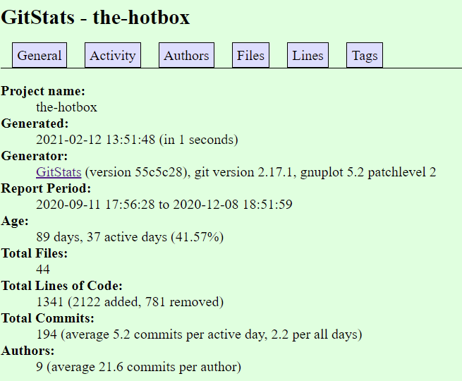
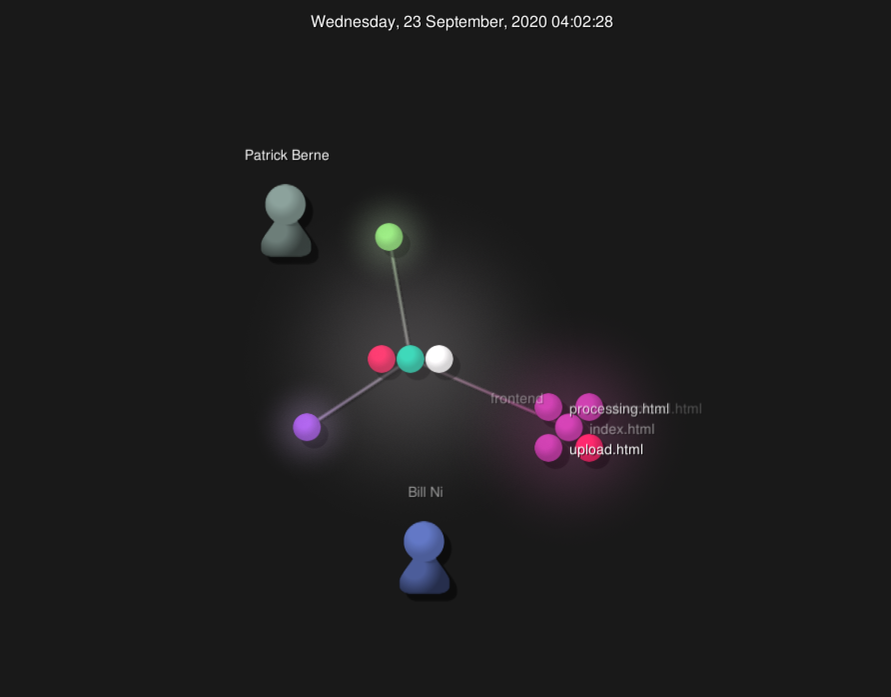

# Lab 03 Report

## Part 1: Documentation

Wiki: https://github.com/MattCzyr/CSCI-4470/wiki/Lab-3

LaTeX:

`$\sqrt{1 + 2 \sqrt{1 + 3 \sqrt{1 + 4 \sqrt{1 + \ldots}}}}$`



`$\sqrt{2}^{\sqrt{2}^{\sqrt{2}^{\sqrt{2}^{\ldots}}}}$`



```
$\begin{bmatrix}
1 & 1 & 1 & 1\\
-1 & 1 & -1 & 1\\
-1 & -1 & 1 & 1\\
1 & -1 & -1 & 1
\end{bmatrix}$
```


## Part 2: Community

Shuttle Tracker:
- Contributors: 33
- Lines of code: ~62,000
- [Initial commit](https://github.com/wtg/shuttletracker/commit/3453b12cb6d53080a0967644eddf44111fef0c54) on January 27, 2015 by gbprz
- [Latest commit](https://github.com/wtg/shuttletracker/commit/3e8b9af6a7d8b341b605f137cf2b4577edd6bed3) on December 4, 2020 by MattCzyr
- Branches: 55


The results of `gitstats` are a bit different than the stats from `git`, but
they're in the same ballpark. For example, 33 contributors vs. 39 contributors,
and ~62,000 lines of code vs. ~53,000 lines of code.

Screenshot of `gource`:


RPI Campus Map:  
- Contributors: 10
- Lines of code: 37,207
- First commit: September 28, 2018
- Latest commit: January 26, 2021
- Branches: master (1 branch)  


After running GitStats, we note a difference in the Contributors, also denoted as *Authors*.  
GitStats reports that there are 18 Authors when Git only revealed 10. Further, the Git
command on line 5 of this document yielded 37207 lines of code in Rpi Campus Map; GitStats
yielded 21118 lines of code (46245 added, 25127 removed).

Screenshot of `gource`:


The Hotbox:

Contributors: 9
Lines of code: 1,014
First commit: September 11, 2020
Latest commit: December 8, 2020
Branches: 6



The `gitstats` page seems to correlate pretty well with my findings, the lines of code is a bit off but I guess that's to be expected.

Screenshot of `gource`:




