# Lab 09 Report

## Example 0

Running the container:

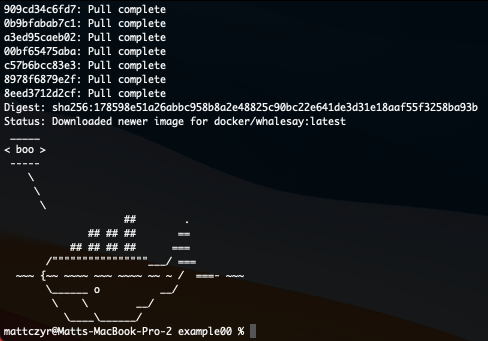

## Example 1

Vim:

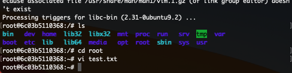

Cowsay:

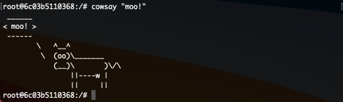

## Example 2

Running the container:

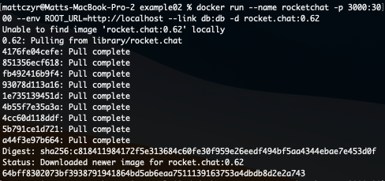

RocketChat in browser:

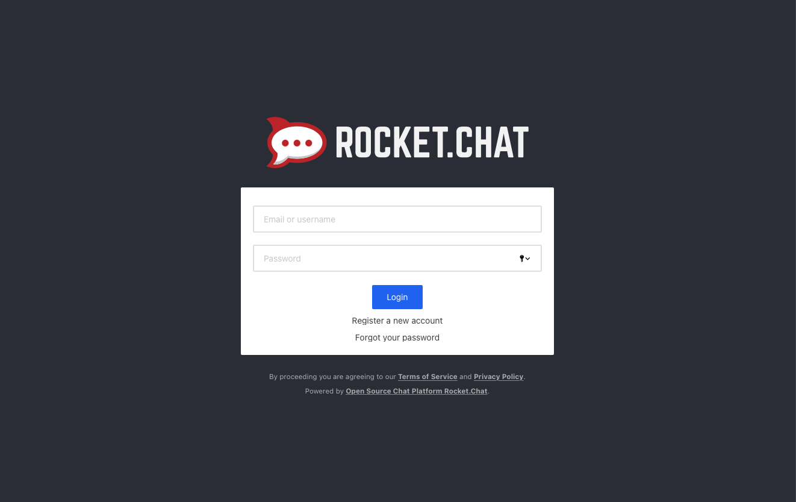

## Example 3

Running the container:

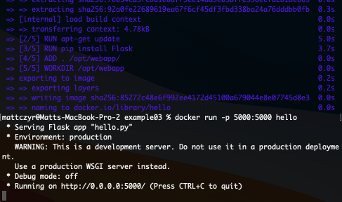

Viewing in browser:

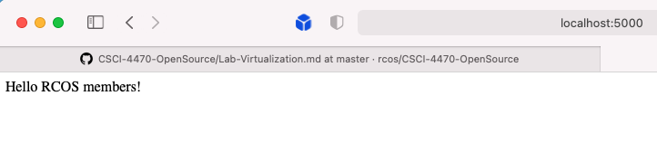

## Example 4

Running the container:

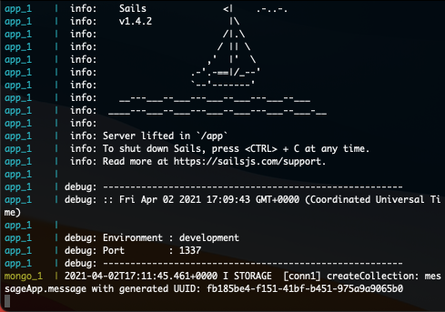

Creating a new message:

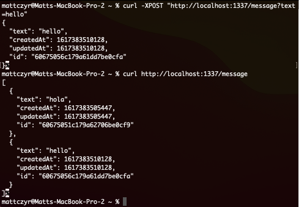

Modifying a message:

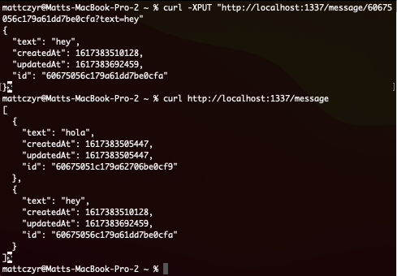

Deleting a message:

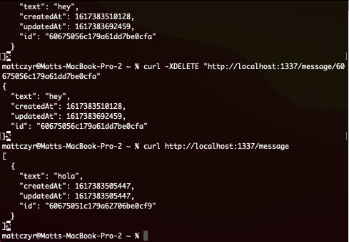