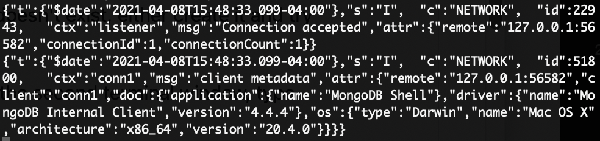
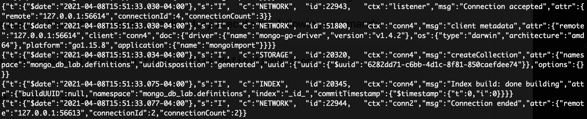
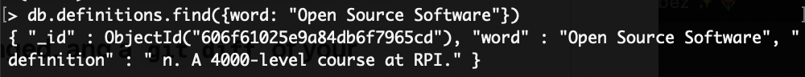
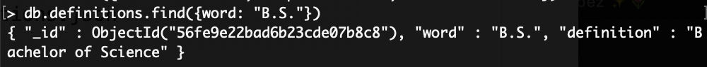
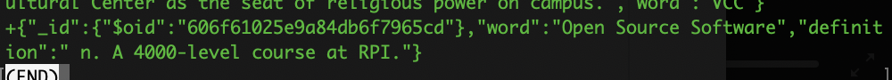
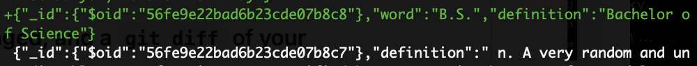
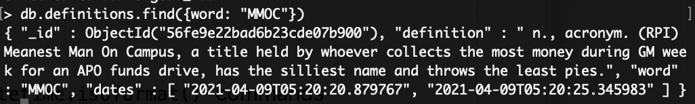

# Lab 10 Report

## Checkpoint 0

Recently, the Supreme Court ruled that Google's partial reimplementation of Oracle's Java API was fair use. I believe this is a good thing for open source. Reimplementing APIs is a common practice, including in the open source community, and a different ruling may have sparked many other similar lawsuits against those who reimplemented others' APIs. A potential consequence of this ruling is that it could weaken the ability to copyright code in general, not only APIs. However, this is not a big concern for open source projects, especially when compared to the ability to use and reimplement APIs freely without worrying about legal repercussions.

## Checkpoint 1

Connecting to the database:



## Checkpoint 2

Importing data:



## Checkpoint 3

Finding my inserted word:



Finding my updated word:



The diff is quite long, as it looks like the order of the definitions got rearranged, but here are the relevant portions:





## Checkpoint 4

Code:

```
from pymongo import MongoClient
import pprint
from bson.objectid import ObjectId

client = MongoClient()

if __name__ == '__main__':
    db = client.mongodb_lab
    definitions = db.definitions

    # Find all records
    print('All records:')
    for definition in definitions.find():
        pprint.pprint(definition)

    # Find one record
    print('\nOne record:')
    pprint.pprint(definitions.find_one())

    # Find a specific record
    print('\nA specific record:')
    pprint.pprint(definitions.find_one({'word': 'Building 102'}))

    # Find a record by object ID
    print('\nA record by object ID:')
    pprint.pprint(definitions.find_one({'_id': ObjectId('56fe9e22bad6b23cde07b948')}))

    # Insert a new record
    definition = {'word': 'Open Source Software', 'definition': 'A 4000-level course at RPI.'}
    definitions.insert_one(definition)
```

Output: [checkpoint4_output.txt](checkpoint4_output.txt)

## Checkpoint 5

Code:

```
from pymongo import MongoClient
import random
import datetime

client = MongoClient()


def random_word_requester():
    '''
    This function should return a random word and its definition and also
    log in the MongoDB database the timestamp that it was accessed.
    '''
    definitions = client.mongodb_lab.definitions
    seed = random.randint(0, definitions.find().count())
    word = list(definitions.find())[seed]
    accessed_at = datetime.datetime.utcnow().isoformat()
    definitions.update_one({'word': word['word']}, {'$push': {'dates': accessed_at}})
    return definitions.find_one({'word': word['word']})


if __name__ == '__main__':
    print(random_word_requester())
```

Finding the duplicate entry:


