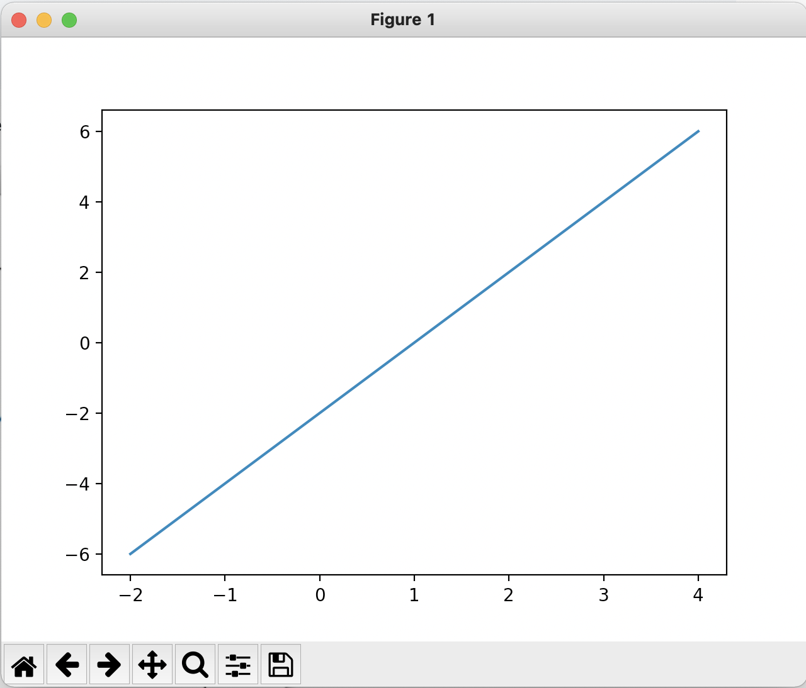
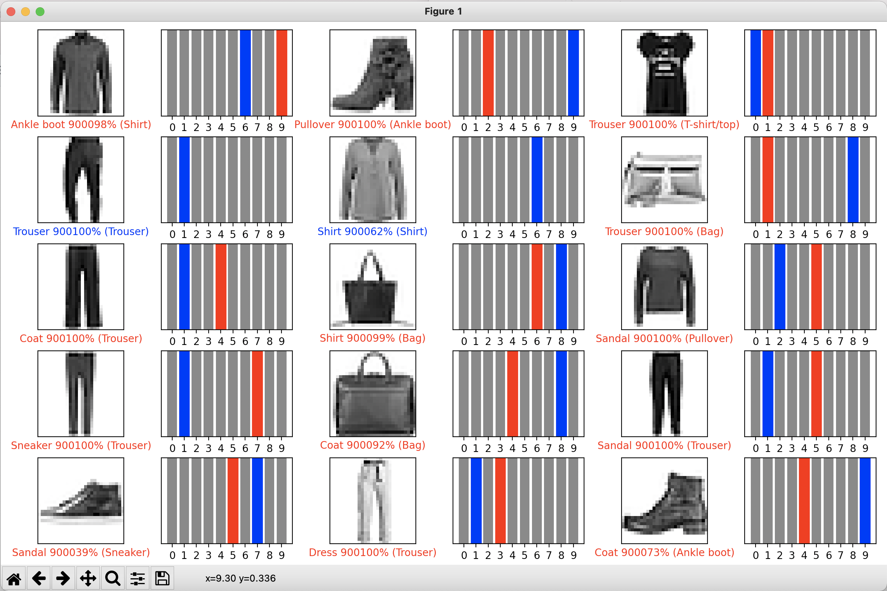
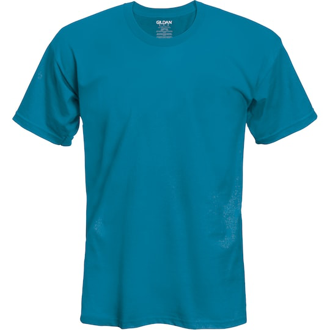
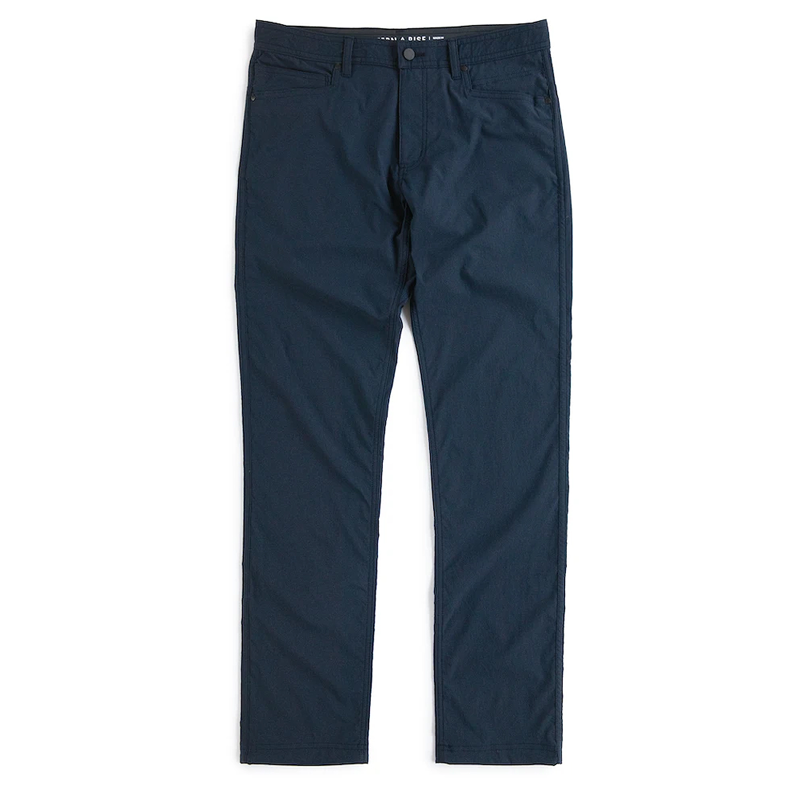
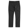
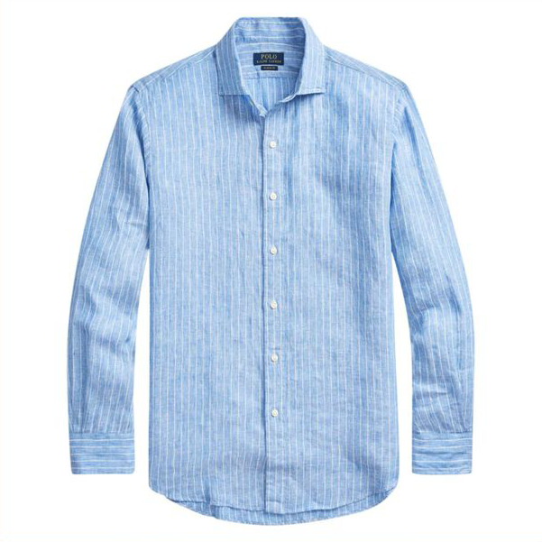
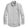

# Lab 11 Report

## Checkpoint 1

Viewing the plot:



## Checkpoint 2

Viewing the plot:



Code:

```
# Plot the first X test images, their predicted labels, and the true labels.
# Color correct predictions in blue and incorrect predictions in red.
num_rows = 5
num_cols = 3
num_images = num_rows*num_cols
plt.figure(figsize=(2*2*num_cols, 2*num_rows))
for i in range(num_images):
  plt.subplot(num_rows, 2*num_cols, 2*i+1)
  plot_image(9000 + i, 9000 + predictions[i], test_labels, test_images)
  plt.subplot(num_rows, 2*num_cols, 2*i+2)
  plot_value_array(9000 + i, 9000 + predictions[i], test_labels)
plt.tight_layout()
plt.show()
```

## Checkpoint 3

### Image #1

Original image:



Resized/grayscale image:


Classification:

```
[ 11.0651     -7.063192   -2.0725195  -4.021465  -11.097079  -23.033028
   6.350914  -35.887474   -9.5262165 -20.52529  ] 0 T-shirt/top
```

### Image #2

Original image:



Resized/grayscale image:



Classification:

```
[ -0.34567305  10.28328     -7.870051    -3.1866617   -5.8347073
 -14.726132    -2.785427   -20.755592   -10.746094   -15.319924  ] 0 T-shirt/top
```

### Image #3

Original image:



Resized/grayscale image:



Classification:

```
[-1.40765   -7.0056963  0.6672141 -2.7066026  1.4791573 -8.190041
  3.4497643 -7.7208815 -3.4526165 -5.5830364] 0 T-shirt/top
```

### Results

Overall, 2 of these 3 classifications were correct, but I'm not sure why the pants were classified as a shirt.

